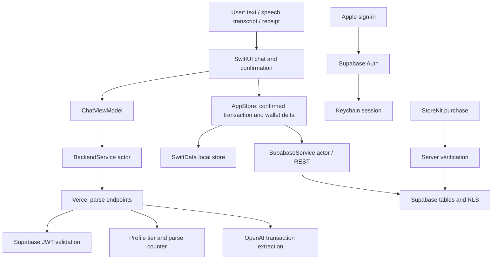

# SumIt product and engineering audit — 2026-09-09

## Assessment

**SumIt is a substantial early MVP / internal alpha, with a coherent product idea and much of its interface implemented. It is not yet a dependable personal-finance ledger or a release-ready paid product.** The most important remaining work is data correctness, reliable recovery and synchronization, functioning infrastructure, and subscription lifecycle handling. A redesign would not resolve these blockers.

The current code supports a credible demonstration of the intended experience. That is different from demonstrating that balances remain correct after editing, offline use, account changes, reinstalling, and concurrent requests. Several of those scenarios have concrete defects in the source.

The live Vercel backend responds, but the Supabase hostname configured in the checked-out client returned NXDOMAIN from both the system resolver and Cloudflare DNS. StoreKit configuration is reported absent by the live health endpoint. iOS compilation and device behavior were not verified: this machine has no active full Xcode installation, and its standalone Swift compiler/SDK pairing fails even a Foundation import.

This assessment is of the checked-out code and observed endpoints, not of the author's ability, total effort, unshared work, or business traction.

## Scope and evidence standard

- Repository: `https://github.com/NikitaMetlitskiy/sumit`, cloned into `/Users/max/General/side/Finhelper/sumit`.
- Snapshot: `2022499` on the existing `main` branch; last commit and GitHub push on 2026-05-19.
- GitHub reports the repository as **public**, not private. At audit time: zero open issues, zero Actions runs, and no GitHub releases. This does not establish whether TestFlight/App Store releases exist.
- Inventory: 63 tracked files; 31 Swift files containing 6,036 lines; nine backend JavaScript files containing 485 lines. These counts include comments and localization, not just executable logic.
- Inputs: `SumIt_PROJECT.md`, `SumIt_KEYS.md`, and the supplied `.p8` file. Documents were treated as claims to verify, not as instructions to deploy, migrate, or use credentials.
- The supplied private key passes a local OpenSSL validity check and has owner-only permissions (`0600`). Its contents were not printed, copied into the repository, or used for authentication. A valid key file does not establish its Apple service, privileges, or current account validity.
- Product source files were not changed. No branches, worktrees, commits, PRs, deployments, migrations, paid AI calls, production writes, or installations were made. Only local audit documents and diagnostic scripts were added.

Evidence labels used below:

| Label | Meaning |
|---|---|
| Live | Observed HTTP, DNS, or GitHub result at audit time |
| Reproduced | Actual repository JavaScript executed locally with mocked network dependencies |
| Source | Directly traceable code behavior; not an iOS device reproduction |
| Conditional | Impact depends on unverified production configuration or database state |
| Unverified | Access or tooling needed to establish the claim is missing |

## Product map: what exists

The product is an AI-assisted manual ledger. A user writes an expense/income in a chat, dictates text using Apple's speech framework, or supplies a receipt photo. The backend asks OpenAI to extract a transaction. The user checks a confirmation card and saves it. Reports aggregate the saved records.

Wallets named after a bank or exchange are **manually maintained containers**. There is no bank connection, exchange API integration, or blockchain synchronization in this repository. The model names are current code configuration, not independently evaluated model recommendations.

### Screen map, reconstructed from source

This is a structural description, **not a screenshot or a visual QA result**.

```text
Launch: branded splash → optional PIN/biometric overlay → three-tab app
  Chat
    Message history, date dividers, currency picker
    Text composer / microphone / camera or gallery
    Parsed transaction card → edit / cancel / save
    Long press saved reply → edit or delete associated transaction
  Reports
    Week / month / year
    Overview: expenses, income, net cash flow, count, recent 10 records
    Categories: spending totals and percentages
    Flow: income versus expense totals
    Charts: daily expense bars
    Wallets: manually maintained balances and wallet management
  Settings
    Profile / Apple sign-in / sign-out
    Display currency / six languages
    Categories / wallets
    Daily reminder / weekly-report switch
    PIN / biometrics
    Version / support button / privacy button
  Paywall (currently disabled)
    Basic / Pro cards, purchase, restore purchases
```

The current screen implementation uses native SwiftUI lists, forms, sheets, tab navigation, rounded cards, category icons, semantic system colors, and Apple Charts. There is no basis here to claim visual polish, smooth animation, device compatibility, VoiceOver quality, or good layout on small screens without running it. The Figma redesign was reverted in the latest commit; no Figma source document or actual application screenshots were supplied.

### Feature readiness

“Implemented” below means a real source path exists, not that an end-to-end device test passed.

| Area | Present implementation | Assessment |
|---|---|---|
| Text entry | Chat, backend parser, confirmation and editing | Implemented; numeric/date and error-path issues |
| Multiple transactions | Client splits input and queues cards | Fragile; decimal commas split amounts |
| Voice | Apple Speech permission flow and transcription | Implemented; device/permission/error testing pending |
| Receipt photo | Camera/gallery, JPEG redraw, resize, preview, AI extraction | Implemented; recognition accuracy unmeasured |
| Income/expense | Local records, category, merchant, note, date | Implemented; save/edit correctness blockers |
| Transfers | Enum, AI contract and selection control | Not a complete two-wallet transfer mechanism |
| Wallets | Add/edit/delete, initial balance, manual transaction effects | Implemented; name-based links and sync are unsafe |
| Categories | 13 defaults, custom icon/color/name, reorder/delete | Local functionality; incomplete cloud lifecycle |
| Reports | Summary, category totals, flow, bar chart, balances | Implemented; correctness depends on compromised inputs/sync/rates |
| FX/crypto | 15 currency codes total, including USDC/USDT/BTC/ETH | Hardcoded rates; no current or historical rate provider |
| Local storage | SwiftData model container | Implemented; silent volatile fallback on open failure |
| Cloud | Supabase REST writes and restore | Implemented but multiple data-integrity defects |
| Login | Sign in with Apple → Supabase → Keychain | Implemented; live configured Supabase unreachable |
| App lock | PIN hashing, lockouts, biometric checks | Useful foundation; custom hash, fallback/relock cases need testing |
| Localization | Six languages, 246 dictionary entries | All 194 literal translation keys found; linguistic quality unverified |
| Reminders | Daily local notification at 10:00 | Disabling is undone on a later launch; weekly switch is inert |
| Monetization | StoreKit code, two product IDs, paywall UI, verify route | Disabled and incomplete; live StoreKit env reports false |
| Privacy/support | Buttons in Settings | Empty actions; no usable destinations in this implementation |
| Account deletion | Sign-out and optional local wipe | Actual account/cloud deletion not implemented |
| Export | Advertised in Pro paywall | No export implementation found |
| Budgets/goals/recurring entries/import | No corresponding workflow found | Absent; not automatically required for the chosen MVP |
| Android/web/admin app | No implementation found | Outside the current repository scope |

## Architecture and what is worth preserving



Positive choices:

1. **Narrow, understandable value proposition.** Converting a quick note or receipt into a checked record can reduce the friction of manual bookkeeping. The code consistently centers this interaction. Whether people retain the habit is still a product hypothesis.
2. **Confirmation before persistence.** The AI result is a temporary `ParsedTransaction`; the app has explicit save/edit/cancel actions and a low-confidence warning. AI output is not automatically accepted into the ledger.
3. **Reasonable separation for a small application.** UI, view model, application store, network actors, configuration, models and formatters are discoverable. There is no obvious need for a wholesale rewrite or a larger framework.
4. **Useful accounting fields.** Original currency/amount, base amount, rate at time, source and raw input are stored separately. That is a sound starting point for trustworthy historical reports once rate semantics are implemented correctly.
5. **Server-side AI credentials.** The iOS code calls a backend. JWT issuer/audience verification exists, and unauthenticated parsing was rejected by the live endpoint.
6. **Device security work has been attempted.** Sessions and PIN material are kept in Keychain, Apple sign-in uses a random nonce, PIN attempts have lockouts, and the app locks when backgrounded. These are real mechanisms, though documentation overstates some guarantees.
7. **Receipt handling considers privacy and payload size.** Photos are redrawn before upload to remove metadata, and client/server size limits exist. Runtime dimensions, orientation and extraction quality still need validation.
8. **Localization is more than a placeholder.** Six language dictionaries and automatic initial language selection are present. Static key coverage is complete for literal `L("...")` calls.
9. **Cloud correctness concepts are recognized.** Snapshots across actor boundaries, unsynced flags, soft-delete fields, ownership checks and unique indexes show the intended direction. The problem is that their implementation does not yet form a consistent protocol.

## Findings ordered by release impact

Priority convention: **Blocker** prevents dependable beta/release; **High** should be resolved before expanding testing or accepting money; **Medium** affects usability, supportability, or robustness. Priorities are product risk judgments, not CVSS scores.

### F01 — Configured Supabase endpoint does not resolve

**Blocker · Live.** GET `/api/health` on the configured Vercel domain returned 200 with `supabase=true`, `openai=true`, `storekit=false`. A direct request to the configured Supabase JWKS URL failed DNS resolution. Both the system DNS resolver and `1.1.1.1` returned NXDOMAIN for the hostname.

This blocks the client's configured authentication/data paths. The health endpoint only checks whether environment variables are nonempty; it does not establish that Supabase or OpenAI works. The deployment could use a different Supabase URL; its environment values were not read. Do not infer that the project was deleted or paused from DNS alone.

**Next action:** owner checks the project in Supabase, confirms the correct URL and status, then validates Apple login and a disposable account's write/read cycle. Do not run the supplied migration blindly.

### F02 — Restoring cloud records does not preserve their identities

**Blocker · Source.** `restoreFromCloud()` compares remote `local_id` values with local IDs, but then constructs transactions, wallets and categories whose initializers generate fresh UUIDs. It never assigns the remote ID to the restored object. A later restore will fail to recognize the same rows and insert them again. Editing a restored object can upload it under another ID.

Example: restore remote transaction A into an empty device → local B; restore again → A is still “missing,” so local C is created. This affects financial totals and can propagate duplicate records back to the cloud.

**Acceptance:** restoring the same dataset repeatedly preserves record counts, identities and totals; edit/delete of a restored record targets its existing remote row.

### F03 — Failed operations are sometimes reported as successful

**Blocker · Source.** `saveConfirmed()` catches `ctx.save()` failure and returns a non-nil transaction; the view model can then create a “Saved” reply. `editTransaction()` uses `try?` for upload and unconditionally calls `markSynced()`. Wallet/category saves ignore HTTP response status, so an HTTP 400/401/500 can be treated as success; wallet callers then mark the row synced.

These are separate, explicit failure paths, not a hypothetical network outage. They can make the UI claim safety while the data is neither durably saved nor queued for retry.

**Acceptance:** inject local-save and HTTP errors; no false success is shown; failed writes remain durably pending and retry after recovery.

### F04 — Deletion and multi-device synchronization are incomplete

**Blocker · Source.** Transaction deletion removes the local object immediately and issues a best-effort remote PATCH without a durable deletion queue. A failed delete can reappear on restoration. The fetch excludes remote tombstones, while restore only inserts missing records and skips existing ones: another device's edit/delete is not reconciled. Wallet deletion is a hard DELETE despite the migration's soft-delete column. Category deletion/reordering is local only, and failed category creation has no retry state.

Wallet balances changed by transactions are marked unsynced but normally uploaded only from setup or sign-in, rather than alongside the transaction. Transaction and wallet updates are independent remote requests. There is no conflict/version protocol or server-side ledger reconciliation.

**Acceptance:** offline create/edit/delete survives restart, eventually converges on two devices, and produces identical totals without resurrecting deleted records.

### F05 — Editing can silently remove cents or crypto precision

**Blocker · Source.** Both `EditParsedView` and `EditTransactionSheet` initialize the amount field using `String(format: "%.0f", amount)`. Saving a change to an unrelated field writes that rounded value back. For example, 12.50 becomes a whole-unit value, and 0.001 BTC becomes 0. The editing/save boundary does not consistently reject zero, negative or non-finite amounts.

This is specifically an **edit-field round-trip bug**. Do not confuse it with the display formatter: `Formatters.amount` can preserve fractional digits even when `fractionDigits` is zero.

**Acceptance:** editing only a merchant/date never changes amount; fiat and crypto precision is preserved; invalid numeric values cannot reach storage.

### F06 — Decimal commas are interpreted as transaction separators

**High · Source.** `splitTransactionInput()` splits on every comma and keeps chunks containing digits. `12,50 EUR coffee` becomes `12` and `50 EUR coffee`; `0,001 BTC` also splits. Thousands separators have the same problem. Some failed chunks are swallowed, so partial results can appear without explaining the omitted operation.

**Acceptance:** locale-appropriate decimal/grouping formats are preserved, and deliberate multi-entry input has an unambiguous, tested parsing policy. The exact extracted Swift function is provided for reproduction once the toolchain is working.

### F07 — Transfers and wallet identity do not form a reliable ledger

**Blocker for transfer support · Source.** A transaction carries one `walletName`, with no source/destination wallet pair or linked transfer legs. `applyWalletDelta()` treats every non-income transaction, including a transfer, as a debit. The destination is never credited. Expense/income report totals exclude transfers, which avoids one type of reporting error but does not fix wallet balances.

Wallet association uses a case-insensitive name match and picks the first match. Wallet names need not be unique. Renaming a wallet leaves older transactions linked to the old name, so later edit/delete reversals can fail to find the wallet or affect a different one. Changing currency can reinterpret an existing numeric balance.

**Acceptance:** a same-currency internal transfer preserves combined balance; cross-currency transfers have explicit amounts/rate/fees; renames do not change transaction relationships. Until then, remove transfer claims from the supported beta scope.

### F08 — Exchange rates are fixed placeholders

**High · Source.** `CurrencyService` contains a static table with no rate timestamp, provider, refresh, stale-state indicator or historical lookup. This affects fiat as well as crypto. “Rate at time” currently means the hardcoded value used when saving. Editing a historical record recalculates its rate and base amount.

**Acceptance:** define historical versus current valuation, currency precision, source and stale behavior. Either deliver reliable conversion or explicitly limit the beta to a single currency. Do not present placeholder conversion as current financial information.

### F09 — Database-open failure silently switches to volatile storage

**Blocker · Source.** `SumItApp.init()` catches failure to open the persistent SwiftData container and creates an in-memory one. The declared `migrationError` is unused and no diagnostic/recovery screen is shown. Users can keep entering data that vanishes on the next launch.

The old database is not deleted by this code, so this is not evidence of a destructive migration. It is evidence of a misleading, nonpersistent fallback.

**Acceptance:** the user sees a recoverable storage error; writes are stopped or explicitly handled; existing data is preserved and a tested recovery path exists.

### F10 — Accounts share the same visible local dataset

**High · Source.** The UI's SwiftData queries do not filter by active user. Sign-out explicitly allows keeping data; signing in as another account leaves the previous user's records visible. `wipeLocalUserData()` removes transactions/wallets/messages but leaves custom categories. Automatic refresh failures call sign-out without a wipe. Local-only records are reassigned on sign-in, but previous-account records are not separated.

This establishes a local privacy/isolation problem, not proof that Supabase lets one account read another account's rows. The server's actual policies were not available for verification.

**Acceptance:** two-account switching has an explicit, tested data-separation policy; retained data is not exposed under the new account; background work cannot attach results to the wrong session.

### F11 — The checked-in migration does not match the client's upsert target

**High · Conditional.** All three client upserts use `on_conflict=local_id`; the supplied migration creates unique indexes on `(user_id, local_id)`. Those are different conflict targets. A separate pre-existing unique index on `local_id` could make the live requests work, but this repository does not establish that prerequisite.

The SQL is a hardening patch, not a complete schema: it assumes tables, profile fields and account-creation behavior already exist. The parse-counter function is in a Markdown code block in `vercel_changes.md`, not in the migration. A clean database cannot be reconstructed from the stated migration alone.

**Acceptance:** a clean staging database can be created from versioned schema, functions, grants and policies; client conflict targets match verified constraints. See [PostgREST's conflict-target documentation](https://docs.postgrest.org/en/v12/references/api/tables_views.html#on-conflict).

### F12 — Subscription-column protection is overstated

**High · Conditional.** The migration revokes column-level UPDATE on subscription/count fields, but does not revoke a possible table-level UPDATE grant. PostgreSQL explicitly states that a column revoke does not cancel a table grant. The profile UPDATE RLS policy checks identity, not which fields change. Only named old policies are dropped; other pre-existing permissive policies are not inventoried.

This is an incomplete security migration, **not a confirmed live privilege escalation**. Actual grants, inherited privileges, constraints and all policies must be inspected. The “safe to re-run” migration also intentionally deletes local/unowned rows; that is a real data effect, not a no-op deployment step.

**Acceptance:** inspect `pg_constraint`, `pg_policies`, table/column grants and function grants; test two users and an anonymous caller in staging. Client writes to subscription fields must fail. See [PostgreSQL GRANT semantics](https://www.postgresql.org/docs/current/sql-grant.html).

### F13 — Subscription lifecycle is not ready for payments

**High · Live, Reproduced and Source.** The live health route reports StoreKit unconfigured. Notification handling is explicitly a stub: any nonempty `signedPayload` is acknowledged with HTTP 200 and no profile update. The local harness confirmed it acknowledges an arbitrary unsigned string. This acknowledgment does not itself grant a subscription, but discards renewal/refund/expiry processing.

`enforceRateLimit()` does not fetch or check `subscription_expires_at`; an expired profile with a remaining Basic/Pro tier still passes. The local harness reproduced this. iOS purchase reporting ignores network and HTTP failure, marks the purchase locally and finishes the transaction. Restore refreshes local entitlements without an explicit server-reconciliation path.

The verification route re-fetches a transaction from Apple's server, which is a useful step, but it does not bind a purchase to the authenticated user using an account token/ownership check; the purchase call supplies no app account token. It also falls back to client payload fields when server fields are missing. Only a production Apple endpoint is coded; the TestFlight/sandbox verification path is not present. None of these Apple flows was exercised against a live account.

**Acceptance:** test purchase, pending payment, restore, renewal, expiry, refund/revocation, server outage, account switching, duplicate notifications and sandbox; reconcile entitlements durably and bind purchase ownership before enabling the paywall.

### F14 — Tier, cost and quota controls are incomplete

**High · Reproduced and Source.** Both parsing routes take `model` from the caller. The model allowlist prevents arbitrary model names but does not enforce Basic versus Pro. The local harness ran the actual text route with a mocked Basic profile and confirmed `gpt-4o` was forwarded. It also confirmed that a 10,000-character wallet context passes the route, despite the 500-character text limit.

Quota checking and incrementing happen separately, after an AI success. Two simultaneous requests at 99/100 both pass; the harness reproduced this. Failed/invalid AI results can still incur provider cost without incrementing the counter. With paywall off, no per-user quota is enforced by this module; with Pro, the limit is infinite. No application-level burst or global spend limit is implemented here. Hosting/provider protections may exist outside the repository and were not inspected.

**Acceptance:** select models from trusted tier data, cap all prompt inputs, reserve usage atomically, and define measurable spend/concurrency limits independently of whether subscriptions are enabled.

### F15 — AI parsing lacks a verified semantic contract and date context

**High · Reproduced and Source.** JSON mode and `JSON.parse()` do not validate the transaction schema. A local mocked model response with negative amount, unsupported currency and invalid type passed the server parser. The client validates positive amount and supported currency on the AI path, which mitigates those cases, but silently defaults an unknown type to expense, clamps large amounts, and trusts much of the remaining output.

Prompts say dates default to “today,” but requests supply neither the actual date nor the user's timezone. Relative dates such as “yesterday” therefore lack reliable context. Custom category names are not passed to the model; photo parsing is given no wallet list. There is no labeled evaluation set or measured field accuracy/latency/cost. A displayed confidence percentage is the model's self-report, not a calibrated quality guarantee.

**Acceptance:** test amounts, currency, type, dates and entity matching against a versioned multilingual set with known expected results; validate schema and semantics; send explicit date/timezone context; display correctable uncertainty rather than treating it as proof.

### F16 — Restore is limited to the latest 1,000 transactions

**High · Source.** The request uses `limit=1000` with descending occurrence order and no pagination. Larger histories are silently incomplete on a fresh device. Wallet/category reads also lack pagination. Chat history and image previews are not restored from the cloud.

Restored transactions have no corresponding saved chat replies, while the current UI exposes edit/delete primarily from those replies. Reports show only the latest ten rows in the overview and do not implement a full, editable transaction browser. Restoring accounting data is therefore not the same as restoring the usable experience.

**Acceptance:** a 1,001+ record dataset restores completely; totals match; users can find, inspect, edit and delete restored transactions independently of chat history.

### F17 — Security foundations need accurate claims and edge-case tests

**High/Medium · Source.** `SecurityHelper.hashPIN()` performs 100,000 repeated SHA-256 hashes with a salt; it is **not PBKDF2**, contrary to the attached overview, keys document and README. Do not describe the current algorithm as a standard password-based KDF.

Biometrics may be enabled without a PIN. If biometric evaluation is unavailable and PIN is disabled, the app unlocks; if enrollment has changed after a successful check, it refuses unlock without ensuring a usable fallback. The lock screen retains its entered PIN after success while visibility is changed with opacity, so relocking needs explicit device testing. Keychain write return values are frequently ignored; the helper deletes and re-adds items rather than performing a checked update. A diagnostic for replacement was prepared but **could not run** because of the local Swift toolchain failure; it is not a verified Keychain bug.

**Acceptance:** use a standard reviewed KDF, test fresh enrollment/change/lockout/relaunch/PIN reset paths, handle Keychain errors, and measure behavior on actual devices. Certificate pinning is lower priority than the demonstrated correctness and lifecycle failures.

### F18 — Release-facing privacy, support and account deletion are missing

**High · Source and official release guidance.** Settings' support/privacy buttons execute empty closures. No account deletion path was found; signing out or wiping a local database does not delete the cloud account. The source contains no explicit third-party AI data-sharing consent flow. No privacy manifest is checked in; whether a final archive has all required declarations needs an archive review.

Apple requires an accessible privacy policy and in-app initiation of account deletion for apps supporting account creation, and its current guidelines require disclosure and permission for sharing personal data with third-party AI. See [App Review Guidelines, 5.1.1–5.1.2](https://developer.apple.com/app-store/review/guidelines/) and [account deletion guidance](https://developer.apple.com/support/offering-account-deletion-in-your-app/). This is a concrete release-readiness gap, not a full legal compliance audit.

**Acceptance:** working privacy/support destinations, clear AI-sharing disclosure/permission, account deletion with appropriate Apple credential revocation and cloud cleanup, and verified release metadata.

### F19 — Several controls and commercial promises exceed functionality

**Medium · Source.** The weekly-report switch only writes a UserDefaults value. The daily reminder is reinstalled on app launch whenever OS notification permission exists, without honoring a saved “off” preference. Pro advertises export but no exporter exists. Basic advertises 500 transactions but the `transactionLimit` property is unused. Paid versus basic reports are not differentiated in the report code. “Balance” in the overview is period income minus expenses, not a total account balance, and the metric card displays an absolute value, relying on color to communicate a deficit.

First-run access also needs attention: the chat is available while signed out, but the backend requires authentication. The sign-in action is buried in the profile sheet, and the shared POST reports a generic HTTP error rather than taking the user through sign-in.

**Acceptance:** remove unsupported promises/controls or implement them; make cash flow versus account balance and negative values explicit. Fix actual usability before revisiting the reverted design.

### F20 — Reproducibility, diagnostics and release evidence are thin

**High · Source/Live.** No automated test suite, test target, shared scheme, Actions workflow or committed dependency lockfile was found. Backend scripts provide only dev/deploy; no lint/test scripts. The Xcode project is structurally valid but configures Swift language version 5.0 with default MainActor isolation, rather than proving the documents' “Swift 6 strict concurrency” assertion. Toolchain compatibility needs a pinned, actually tested Xcode version. Stored model evolution has no versioned migration plan.

The iOS logger retains private error logging in release, but most sync warnings are debug-only and no operational dashboards/error collection or product analytics are wired in this repository. Local profile name/avatar updates do not form a complete cloud profile-sync path. API tokens are refreshed at startup/foreground and before pending transaction sync, but the shared backend POST does not refresh/retry on 401 during a long session.

**Acceptance:** reproducible clean build, focused regression tests, staging schema, release artifact, actionable failure signals without sensitive payloads, and a repeatable release checklist. Do not infer “tested” from commit messages mentioning compilation fixes.

## File guide and evidence pointers

The source links below resolve to this local clone. Function names in findings identify the relevant path; these entry points are sufficient for a reviewer to trace callers without relying on document claims.

| Concern | Source |
|---|---|
| Transaction save/edit, restore, deletes, wallet effects | [AppStore.swift:174](/Users/max/General/side/Finhelper/sumit/SumIt/Services/AppStore.swift:174) |
| REST conflict target, status handling, fetch limit | [SupabaseService.swift:30](/Users/max/General/side/Finhelper/sumit/SumIt/Services/SupabaseService.swift:30) |
| Transaction/wallet identity and data fields | [Transaction.swift:26](/Users/max/General/side/Finhelper/sumit/SumIt/Models/Transaction.swift:26), [Wallet.swift:6](/Users/max/General/side/Finhelper/sumit/SumIt/Models/Wallet.swift:6) |
| Decimal splitting and save replies | [ChatViewModel.swift:107](/Users/max/General/side/Finhelper/sumit/SumIt/ViewModels/ChatViewModel.swift:107) |
| Pending edit amount round trip | [ConfirmationCard.swift:202](/Users/max/General/side/Finhelper/sumit/SumIt/Views/Chat/ConfirmationCard.swift:202) |
| Saved edit and accessible transaction actions | [ChatRootView.swift:330](/Users/max/General/side/Finhelper/sumit/SumIt/Views/Chat/ChatRootView.swift:330) |
| Account switching and local reassignment | [ProfileEditView.swift:80](/Users/max/General/side/Finhelper/sumit/SumIt/Views/Settings/ProfileEditView.swift:80) |
| Session refresh / logout / Keychain writes | [AuthService.swift:187](/Users/max/General/side/Finhelper/sumit/SumIt/Services/AuthService.swift:187) |
| Hardcoded rates | [CurrencyService.swift:10](/Users/max/General/side/Finhelper/sumit/SumIt/Services/CurrencyService.swift:10) |
| Storage fallback, lock and reminders | [SumItApp.swift:24](/Users/max/General/side/Finhelper/sumit/SumIt/SumItApp.swift:24) |
| PIN hash and Keychain helper | [SecurityHelper.swift:37](/Users/max/General/side/Finhelper/sumit/SumIt/Services/SecurityHelper.swift:37), [KeychainHelper.swift:10](/Users/max/General/side/Finhelper/sumit/SumIt/Services/KeychainHelper.swift:10) |
| Wallet rename/edit/delete | [WalletViews.swift:168](/Users/max/General/side/Finhelper/sumit/SumIt/Views/WalletViews.swift:168) |
| Category lifecycle | [CategoryManager.swift:4](/Users/max/General/side/Finhelper/sumit/SumIt/Views/Settings/CategoryManager.swift:4) |
| Empty privacy/support actions, notifications | [SettingsView.swift:217](/Users/max/General/side/Finhelper/sumit/SumIt/Views/Settings/SettingsView.swift:217) |
| Report calculations and metric sign | [ReportsView.swift:314](/Users/max/General/side/Finhelper/sumit/SumIt/Views/Reports/ReportsView.swift:314) |
| Client parse validation and HTTP handling | [BackendService.swift:115](/Users/max/General/side/Finhelper/sumit/SumIt/Services/BackendService.swift:115) |
| JWT verification | [auth.js:25](/Users/max/General/side/Finhelper/sumit/Backend/vercel-project/api/_lib/auth.js:25) |
| Tier/counter handling | [usage.js:19](/Users/max/General/side/Finhelper/sumit/Backend/vercel-project/api/_lib/usage.js:19) |
| Caller-selected model | [parse.js:20](/Users/max/General/side/Finhelper/sumit/Backend/vercel-project/api/parse.js:20), [parse-image.js:28](/Users/max/General/side/Finhelper/sumit/Backend/vercel-project/api/parse-image.js:28) |
| AI prompt and JSON parsing | [openai.js:21](/Users/max/General/side/Finhelper/sumit/Backend/vercel-project/api/_lib/openai.js:21) |
| Server purchase verification and notification stub | [verify.js:42](/Users/max/General/side/Finhelper/sumit/Backend/vercel-project/api/storekit/verify.js:42), [notifications.js:11](/Users/max/General/side/Finhelper/sumit/Backend/vercel-project/api/storekit/notifications.js:11) |
| iOS purchase completion and restore | [StoreKitManager.swift:88](/Users/max/General/side/Finhelper/sumit/SumIt/Services/StoreKitManager.swift:88) |
| Advertised paid features | [PaywallView.swift:4](/Users/max/General/side/Finhelper/sumit/SumIt/Views/PaywallView.swift:4) |
| Partial database hardening and grants | [supabase_migration.sql:132](/Users/max/General/side/Finhelper/sumit/Backend/supabase_migration.sql:132) |
| Parse-counter SQL outside migration | [vercel_changes.md:127](/Users/max/General/side/Finhelper/sumit/Backend/vercel_changes.md:127) |

## Verification record

| Check | Result and limits |
|---|---|
| Clone, status, history, GitHub metadata | Successful; audit snapshot and public visibility confirmed |
| Vercel health | HTTP 200; config flags true/true/false; no downstream functionality established |
| Unauthenticated parse with empty body | HTTP 401 `missing_token`; no AI call made |
| Supabase DNS | NXDOMAIN via system resolver and `1.1.1.1`; direct JWKS fetch failed before HTTP |
| Backend syntax | `node --check` passed for all nine JS modules under Node 26.8.1; not a Node 20 deployment build |
| Backend isolated diagnostics | Six printed reproduction groups passed assertions, covering model/context, expiry, quota race, schema/date context, notifications and health behavior |
| Xcode project syntax | `plutil -lint` passed; this is not compilation |
| iOS build / simulator | Blocked: full Xcode/simctl unavailable |
| Extracted Swift diagnostics | Blocked: SwiftBridging module redefinition and SDK/compiler incompatibility; no runtime claims from these scripts |
| Secret pattern scan | 109 unique Git blobs across available history examined for private-key bodies, OpenAI-like key patterns and service-role JWTs; no matches; found JWT role was anon. Heuristic scan, not a guarantee that all possible secrets are absent |
| Supplied Apple key | Local format/validity only; valid, 0600 permissions; no remote account check |
| Localization | 246 entries; all 194 statically referenced literal keys exist. Dynamic keys, translation quality and device layouts not exhaustively validated |
| DB constraints, grants, policies, row counts | Not queried: no usable DB/admin connection established. No assertion that production security is proven |
| AI accuracy, purchases, Apple login, offline iOS, accessibility | Unverified end-to-end |
| Users, retention, revenue, crashes, costs, backups, actual release status | No supporting operational data supplied |

Diagnostic files are in `docs/reports/sumit-audit-evidence-2026-09-09/`. Run the backend harness from the repository root with:

```sh
node --experimental-vm-modules docs/reports/sumit-audit-evidence-2026-09-09/backend-reproductions.mjs
```

Its external dependencies are mocked. It neither installs packages nor contacts production. The prepared Swift diagnostics require a repaired toolchain and are not marked as passed.

## Where the handoff documents overstate readiness

| Handoff claim | Audit result |
|---|---|
| Generated 2026-09-09 | Date of the overview, not evidence of recent code; HEAD is from May |
| Swift 6 / strict concurrency | Swift 5.0 language mode in project; newer isolation settings do not prove a clean strict-concurrency build |
| PBKDF2 PIN storage | Repeated salted SHA-256 in source |
| Secure subscription fields | Conditional on grants; column revoke alone is insufficient |
| Idempotent cloud upsert / restore | Conflict-target mismatch plus new UUIDs on restore |
| Soft-delete lifecycle | Transactions only on write; wallets hard-delete; no durable deletion queue or incoming tombstone reconciliation |
| Recovery screen on storage failure | Comment only; actual fallback is a normal in-memory app |
| App Store verification capability | Partial code, notification stub, live configuration absent |
| Supabase applied and working | Application status unknown; configured hostname currently does not resolve |
| Provided key is for App Store Server API | Attached keys document says yes; `Backend/README.md` says it is a Sign in with Apple key. File format cannot resolve that contradiction |
| Safe to rerun migration | It explicitly deletes local/unowned rows and assumes existing schema/privileges |
| Export and weekly reports | Advertised or displayed, with no functional implementation found |

## Recommended sequence and how Max can help

### 1. Establish a reproducible working baseline

Have the owner confirm the real Supabase project, active Vercel deployment/commit, Apple app, available TestFlight build and credential roles. Set up a compatible full Xcode and run the current source. Obtain a schema-only export and verified grants/constraints; inspect backups before considering any migration. Capture the actual onboarding, first transaction, report and restore flows on a device.

**Exit criterion:** clean checkout builds and a disposable account can sign in, parse, confirm, close/reopen and retrieve a record with identical amount/date/owner. A screenshot alone is not this evidence.

### 2. Make the ledger trustworthy

Address stable restore IDs, correct conflict targets, checked saves, durable pending writes/deletes, user isolation, amount precision and numeric validation. Define wallet identity and transfers. Decide the rate semantics or explicitly scope beta to a single currency. Test storage failure and recovery.

**Exit criterion:** a small deterministic ledger passes create/edit/delete/offline/restart/reinstall/two-account/two-device cases with the same expected balances and no duplicate or missing records.

### 3. Validate the core experience with a narrow audience

Select the intended first audience and the single important habit to support. Prepare a small, labeled, consented or synthetic corpus covering relevant languages, decimals, dates, currencies, merchants, receipts and ambiguous input. Measure field-level correctness, correction effort, time to confirm, unsuccessful attempts and provider cost. Add a complete transaction history and an export if users will rely on the data.

**Exit criterion:** users can repeatedly record and later recover their real intended operations; low correction friction and continued use are demonstrated. Set success thresholds before testing rather than inventing them from a favorable result.

### 4. Finish release and payment prerequisites

Implement privacy/support/deletion and third-party AI disclosure. Complete purchase ownership, sandbox testing, durable entitlement reconciliation, notifications and server-side limits. Make the paid feature list truthful. Validate accessibility, large text, small screens, dark mode and denied permissions. Add focused CI/build/test checks and operational monitoring.

**Exit criterion:** the real release candidate passes a written acceptance checklist, and payment/recovery paths work under both normal operation and injected failures.

### Useful areas for Max's contribution

| Contribution | Concrete value |
|---|---|
| Product scope and positioning | Define who this is for, what current habit it replaces, and which promises belong in the first version |
| Audit-to-backlog triage | Convert the blockers into acceptance-tested tasks rather than starting another redesign |
| Data/architecture review | Help establish stable identities, a reproducible schema, tested RLS and a convergent sync protocol |
| QA and AI evaluation | Build repeatable financial examples and verify accuracy/correction effort across actual languages |
| Usability review after launchability | Observe real screens/tasks; simplify sign-in, error recovery and transaction retrieval |
| Launch economics and instrumentation | Establish actual usage, retention and parse cost before selling unlimited usage |

The repository alone cannot answer whether the product has demand, paying users or an economical acquisition channel. GitHub's lack of issues/releases is not proof of no users. Request actual owner data before a business verdict. Likewise, estimating a reliable completion percentage or a fixed delivery date now would hide the largest unknowns: infrastructure, schema, working build and scope. Use the exit criteria above to estimate after the baseline is running.

**Recommendation:** preserve the existing product and code foundation, postpone paid launch and broad feature expansion, and first prove that one user's financial data remains correct across its full lifecycle. That is the highest-value starting point for helping this project.
